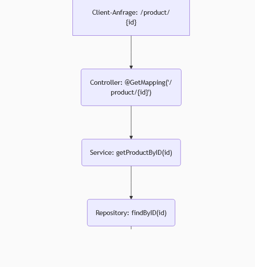
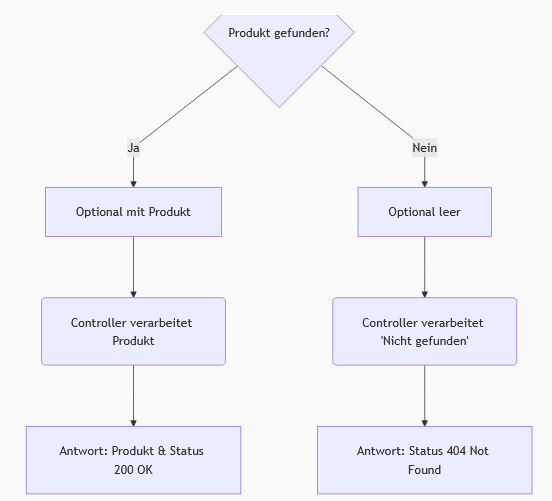

## Abrufen eines einzelnen Produkts nach ID
- Der Client sendet eine Anfrage an den Server, um ein einzelnes Produkt abzurufen, indem er die **ID** des Produkts in der URL übermittelt, z.B. `/product/1`.
- Auf der Backend-Seite wird im Controller eine Methode (`getProduct`) mit `@GetMapping("/product/{id}")` definiert, um die Anfrage abzubilden und die **ID** als `@PathVariable int ID` zu extrahieren.
- Diese Controller-Methode delegiert die Anfrage an eine Service-Methode (`getProductByID`), die die extrahierte **ID** übergibt.
- Die Service-Schicht wiederum ruft die Repository-Schicht auf, um das Produkt mittels `findByID(ID)` abzurufen.
- Die Methode `findByID` gibt ein `Optional<Product>` zurück, da das Produkt mit der angegebenen ID möglicherweise nicht existiert.
- Um einen `NullPointerException` zu vermeiden, kann das `Optional` mit `.get()` (wenn das Vorhandensein sicher ist) oder `.orElse(null)` behandelt werden, wobei letzteres im Controller auf `null` geprüft werden kann.

Hier ist ein Flussdiagramm, das den Prozess des Abrufens eines Produkts nach ID visualisiert:

## Datumsformatierung mit @JsonFormat
- Standardmäßig kann das Format von Datumsangaben (z.B. `releaseDate`) in der Datenbank oder im JSON-Response unleserlich sein.
- Um das Datumsformat zu ändern, kann die Annotation `@JsonFormat` aus der Jackson-Bibliothek verwendet werden.
- Diese Annotation wird über dem entsprechenden Datumsfeld in der Produkt-Entitätsklasse platziert.
- Man konfiguriert `shape = JsonFormat.Shape.STRING` und gibt ein `pattern` an, z.B. `pattern = "dd/MM/yyyy"`, um das gewünschte Anzeigeformat zu definieren (wobei `MM` für den Monat steht).
- Nach dem Neustart der Anwendung wird das Datum im gewünschten Format angezeigt, was die Lesbarkeit verbessert.

## Verwendung von ResponseEntity für HTTP-Statuscodes
- Es ist vorteilhaft, neben den Daten auch explizite HTTP-Statuscodes in der Serverantwort zu senden, um die Fehlerbehandlung im Frontend zu erleichtern.
- Anstatt nur das Produkt oder eine Liste von Produkten zurückzugeben, sollte der Rückgabetyp der Controller-Methoden zu `ResponseEntity<T>` geändert werden, wobei `T` der Typ der zurückgegebenen Daten ist (z.B. `ResponseEntity<List<Product>>` oder `ResponseEntity<Product>`).
- Ein `ResponseEntity`-Objekt wird erstellt, indem die Daten und der gewünschte `HttpStatus` übergeben werden, z.B. `new ResponseEntity(products, HttpStatus.OK)` für eine erfolgreiche Antwort.
- Für den Fall, dass ein Produkt nach ID angefragt wird und nicht gefunden wird, kann ein `ResponseEntity` mit dem Status `HttpStatus.NOT_FOUND` (404) zurückgegeben werden, z.B. `new ResponseEntity(HttpStatus.NOT_FOUND)`.
- Ein `HttpStatus.OK` (200) ist der bevorzugte Status für erfolgreiche Datenabrufe, während `HttpStatus.FOUND` (302) in diesem Kontext nicht ideal ist.